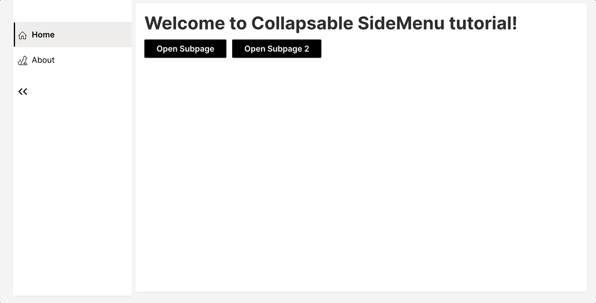

# Collapsable & Expandable SideMenu
<p align="center"></p>

Collapsable & Expandable SideMenu object for H2O Wave projects

This repo includes 2 tutorials of how to use the SideMenu object. The first one (`collapsable_tutorial.py`) is a collapsable SideMenu and the second one (`collapsable_expanding_tutorial.py`) is a both collapsable and expandable SideMenu. The latter is a bit more complex than the former in terms of handling. The `collapsable_tutorial.py` is a good starting point to understand how the SideMenu object works.

### Clone the project & create the venv
```
make setup
```

### Run only collapsable SideMenu tutorial
```
make run  # visit localhost:10101/demo in your browser
```

#### How it looks


### Run both collapsable and expandable SideMenu tutorial
```
make run-expanding  # visit localhost:10101/demo in your browser
```
#### How it looks


----
## How it works
Create a new SideMenu object with the collapsable parameter set to True. Also, pass a list of SideMenuItems to the items parameter.
```
side_menu_items = [
    SideMenuItem(
        name="home", # name of the item
        label="Home", # label of the item 
        group="Group 1", # group name to place the item
        icon="Home", # icon of the item 
        render=True, # whether to render the item or not
    ),
    SideMenuItem(
        name="about",
        label="About",
        group="Group 2",
        icon="Info",
        render=True,
    ),
    SideMenuItem(
        name="contact",
        label="Contact",
        group="Group 2",
        icon="Contact",
        render=True,
    ),
]

q.app.side_menu = SideMenu(
    items=side_menu_items,
    collapsable=True,
)
```
When it comes to rendering the navbar, the state of collapsed parameter will be used to determine if the navbar should be rendered as a collapsable navbar or not.
```
q.page["sidemenu"] = ui.nav_card(
        box=ui.box(zone="sidebar", width=q.app.side_menu.width, height=q.app.side_menu.height),
        items=q.app.side_menu.get_nav_content(q=q),
        value=q.app.active_page,
    )
```
When `side_menu_toggle_collapse` is clicked, the state of collapsed parameter needs to be toggled.
```
if q.args["side_menu_toggle_collapse"]:
        q.app.side_menu.toggle_state()
```

### More parameters to control SideMenu

`collapsed` - Whether the SideMenu is collapsed or not.Default is False.

`collapsable` - Whether the SideMenu is collapsable or not. Default is True.

`disable_group_names` - Whether to disable group names or not. Default is True.

`auto_width` - Whether to automatically set the width of the SideMenu based on max label length or not. Default is True.

`documentation` - Whether to show the documentation item or not. Default is False.

### Expanding a side-menu item with more sub items
This requires extra handling when sub-items are clicked. SideMenu object needs to know what the active root item is and whether it is expanded or not. This is done by keeping `active_root_item` and `expanded` parameters up-to-date in the SideMenu object.

Let's say we have a SideMenuItem called "Home" with sub_items "Subpage" and "Subpage 2"
```
side_menu_items = [
    SideMenuItem(
        name="home", # name of the item
        label="Home", # label of the item
        group="Group 1", # group name to place the item
        icon="Home", # icon of the item
        render=True, # whether to render the item or not
        sub_items=[
            SideMenuItem(
                name="subpage",
                label="Subpage",
                render=False,
            ),
            SideMenuItem(
                name="subpage2",
                label="Subpage 2",
                render=False,
            ),
        ],
    ),
]
```
When "subpage" is clicked, we need to update the state of `active_root_item` and `expanded` parameters in the SideMenu object. Also we need to set render to True for the subitems of the active root item, which is "Home" in this case.
```
if q.args["subpage"]:
        q.app.side_menu.disable_subitems()  # Clear all subitems
        root_item = q.app.side_menu.get_root_item("subpage")
        q.app.side_menu.enable_subitems(root_item.name) # Enable subitems of the active root item
        q.app.side_menu.active_root_item = root_item # Set the active root item
        q.app.side_menu.expand_root_item = True # Expand the active root item
```
